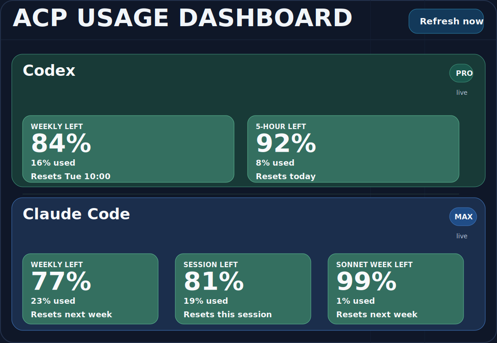

# ACP Monitor

ACP Monitor is a single-page local dashboard for watching your Codex and Claude Code subscription usage from one place.

## Dashboard preview



At a glance, ACP Monitor shows:

- Codex weekly and short-window usage left from local `~/.codex` session telemetry.
- Claude Code weekly, session, and Sonnet-only weekly usage left from the `/status` Usage tab.
- Reset times in your local timezone, plus clear unavailable states when a provider does not expose a monthly number.

## What it shows

- Codex weekly left percentage from the latest local `~/.codex` session log snapshot.
- Codex short-window left percentage from the same rate-limit payload.
- Claude weekly left percentage by driving the supported interactive `claude` `/status` Usage tab in a PTY.
- Claude session and Sonnet-only weekly windows from that same screen.
- Monthly cards only when the provider exposes a real monthly percentage. Otherwise ACP Monitor marks them unavailable instead of guessing.

## Why monthly may be unavailable

- Codex local subscription telemetry exposes short-window and weekly limits, not a monthly percentage.
- Anthropic's published Claude Code analytics do not expose monthly usage analytics for individual Pro or Max plans.

## Run it

### Before you start

Required:

- Node.js and `npm` installed
- internet access for the first `npm install`
- a terminal or command prompt opened in this project folder

Optional, but needed for real usage data:

- Codex CLI installed and logged in
- Claude Code CLI installed and logged in

Quick checks:

```bash
node -v
npm -v
codex --version
claude --version
```

If `codex` or `claude` are missing, ACP Monitor can still open, but those cards may show unavailable data until the CLI is installed and authenticated.

### Quick start for first-time users

These commands are the same on macOS, Linux, WSL, Windows PowerShell, and Windows `cmd.exe`:

```bash
npm install
npm run dev
```

Then open:

- `http://localhost:5173`

What happens:

- the frontend starts on `http://localhost:5173`
- the local API starts on `http://localhost:8787`
- your browser shows the dashboard immediately

If something fails:

- `npm: command not found` or `node: command not found`: install Node.js first
- `codex` or `claude` errors inside the app: the dashboard can still load, but that provider may show unavailable data
- port already in use: stop the old process using that port, then run `npm run dev` again

## Production build

For a more stable local run, build once and run the production server.

Works on Linux, macOS, Windows, and WSL:

```bash
npm run build
npm run start
```

By default, `npm run start` serves the built frontend and `/api/usage` from the same process on `http://localhost:8787`.

If you want production on port `5173` instead:

macOS, Linux, or WSL:

```bash
PORT=5173 npm run start
```

Windows PowerShell:

```powershell
$env:PORT=5173
npm run start
```

Windows `cmd.exe`:

```bat
set PORT=5173 && npm run start
```

## Persistent run

For a persistent local setup, run the production server rather than `npm run dev`:

```bash
npm run build
npm run start
```

What changes by operating system is the process manager used to keep ACP Monitor alive after terminal close or reboot:

- Linux: `systemd`
- macOS: `launchd`
- Windows: Task Scheduler, NSSM, or another service wrapper
- WSL: `systemd` inside the Linux distro, plus a Windows-side startup task to launch WSL

The files under `ops/` are setup templates. They do not change anything on a machine unless the user installs or runs them.

## Persistent run on WSL

This subsection is only for Windows users running ACP Monitor inside WSL.

### One-command setup

Use the installer script:

```bash
npm run setup:wsl-service
```

What it does:

- detects your Linux username, home directory, project path, and `node` path
- tries to find `codex` and `claude`
- asks you to copy-paste a path only if detection fails
- runs `npm run build`
- installs `/etc/systemd/system/acp-monitor.service`
- enables and starts the service

The service serves ACP Monitor on `http://localhost:5173`.

### Manual template

If you want to install the service manually, the template is at `ops/systemd/acp-monitor.service`.

Install it with:

```bash
npm run build
sudo cp ops/systemd/acp-monitor.service /etc/systemd/system/acp-monitor.service
sudo systemctl daemon-reload
sudo systemctl enable --now acp-monitor
```

After frontend or server changes:

```bash
npm run build
sudo systemctl restart acp-monitor
```

### Optional Windows logon startup

After `npm run setup:wsl-service`, the installer prints the exact Windows PowerShell command for your current distro and project path.

If you need the generic form, run this once in Windows PowerShell:

```powershell
powershell -ExecutionPolicy Bypass -File "\\wsl.localhost\<DistroName>\<path-to-acp-monitor>\ops\windows\Register-AcpMonitorWslAutostart.ps1" -DistroName "<DistroName>"
```

Replace `<DistroName>` and `<path-to-acp-monitor>` with your own WSL distro name and project path.

The script creates a Task Scheduler entry named `ACP-Monitor-WSL-Autostart` that launches:

```text
wsl.exe -d <DistroName> --exec /bin/true
```

That is enough to start the distro, and because `acp-monitor` is enabled under `systemd`, the service comes up automatically during WSL startup.

## Important caveats

- The Claude adapter opens a short-lived interactive `claude` session and switches to the `/status` Usage tab every refresh cycle.
- The Codex adapter reads local session logs rather than calling a public consumer usage endpoint.
- No credentials are copied into the frontend. All subscription inspection stays on the local server side.
